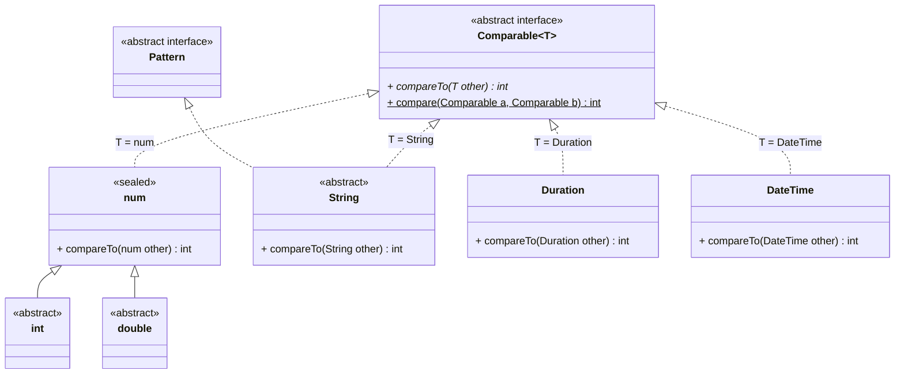
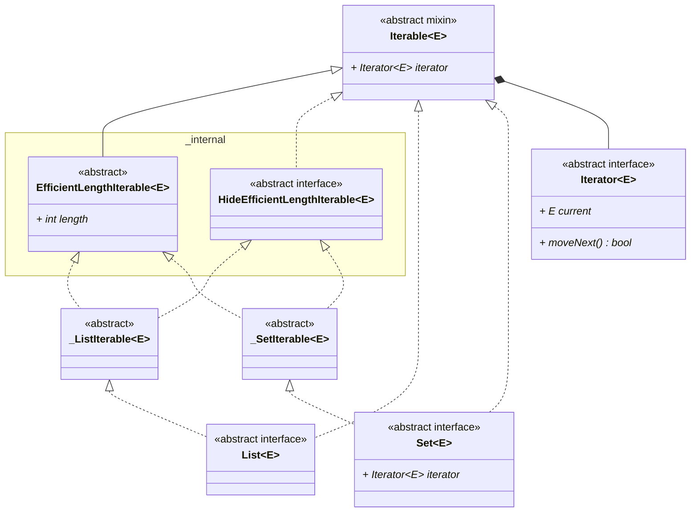

# core

## Comparable

```mermaid
classDiagram
  class Comparable~T~ {
    <<abstract interface>>
    + compareTo(T other) int *
    + compare(Comparable a, Comparable b) int $
  }
  class Pattern {
    <<abstract interface>>
  }
  class num {
    <<sealed>>
    + compareTo(num other) int
  }
  class int {
    <<abstract>>
  }
  class double {
    <<abstract>>
  }
  class String {
    <<abstract>>
    + compareTo(String other) int
  }
  class Duration {
    + compareTo(Duration other) int
  }
  class DateTime {
    + compareTo(DateTime other) int
  }

  Comparable <|.. num : T = num
  Comparable <|.. String : T = String
  Comparable <|.. Duration : T = Duration
  Comparable <|.. DateTime : T = DateTime
  Pattern <|.. String
  num <|-- int
  num <|-- double
```

### num

### int

### double

### String

### Duration

### DateTime

## Iterable

```mermaid
classDiagram
  class Iterator~E~ {
    <<abstract interface>>
    + E current *
    + moveNext() bool *
  }
  class Iterable~E~ {
    <<abstract mixin>>
    + Iterator~E~ iterator *
  }
  namespace _internal {
    class EfficientLengthIterable~E~ {
      <<abstract>>
      + int length *
    }
    class HideEfficientLengthIterable~E~ {
      <<abstract interface>>
    }
  }
  class _ListIterable~E~ {
    <<abstract>>
  }
  class List~E~ {
    <<abstract interface>>
  }
  class _SetIterable~E~ {
    <<abstract>>
  }
  class Set~E~ {
    <<abstract interface>>
    + Iterator~E~ iterator *
  }

  Iterable <|-- EfficientLengthIterable
  Iterable <|.. HideEfficientLengthIterable
  EfficientLengthIterable <|.. _ListIterable
  HideEfficientLengthIterable <|.. _ListIterable
  EfficientLengthIterable <|.. _SetIterable
  HideEfficientLengthIterable <|.. _SetIterable
  Iterable <|.. List
  _ListIterable <|.. List
  Iterable <|.. Set
  _SetIterable <|.. Set

  Iterable *-- Iterator
```

### List

### Set
