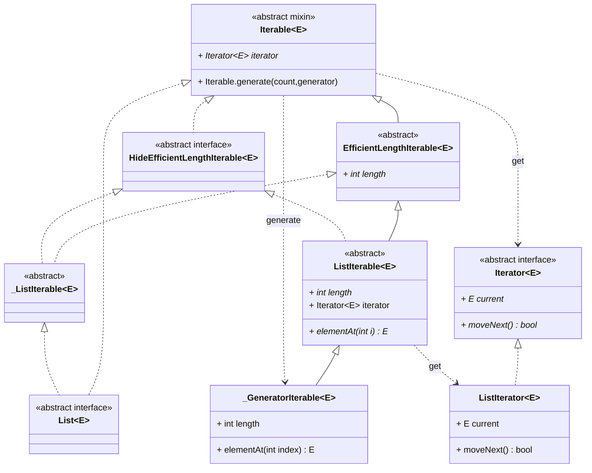

# Iterable

```mermaid
classDiagram
  %% core
  class Iterator~E~ {
    <<abstract interface>>
    + E current *
    + moveNext() bool *
  }
  class Iterable~E~ {
    <<abstract mixin>>
    + Iterator~E~ iterator *
    + Iterable.generate(count,generator)
  }
  class _ListIterable~E~ {
    <<abstract>>
  }
  class List~E~ {
    <<abstract interface>>
  }
  class _GeneratorIterable~E~ {
    + int length
    + elementAt(int index) E
  }

  %% _internal
  class EfficientLengthIterable~E~ {
    <<abstract>>
    + int length *
  }
  class HideEfficientLengthIterable~E~ {
    <<abstract interface>>
  }
  class ListIterable~E~ {
    <<abstract>>
    + int length *
    + Iterator~E~ iterator
    + elementAt(int i) E *
  }
  class ListIterator~E~ {
    + E current
    + moveNext() bool
  }

  Iterable <|-- EfficientLengthIterable
  Iterable <|.. HideEfficientLengthIterable
  EfficientLengthIterable <|-- ListIterable
  HideEfficientLengthIterable <|.. ListIterable
  ListIterable <|-- _GeneratorIterable
  EfficientLengthIterable <|.. _ListIterable
  HideEfficientLengthIterable <|.. _ListIterable
  Iterator <|.. ListIterator
  Iterable <|.. List
  _ListIterable <|.. List

  Iterable ..> Iterator : get
  Iterable ..> _GeneratorIterable : generate
  ListIterable ..> ListIterator : get
```
