# Element

**Widget**

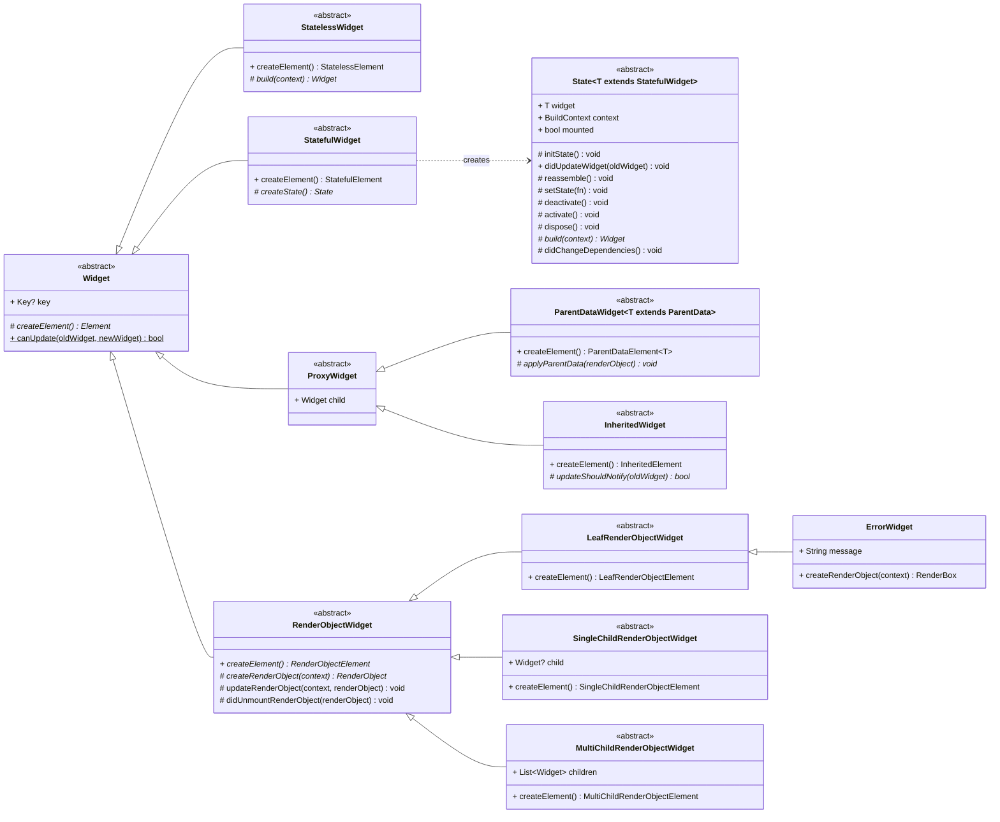

**Element**

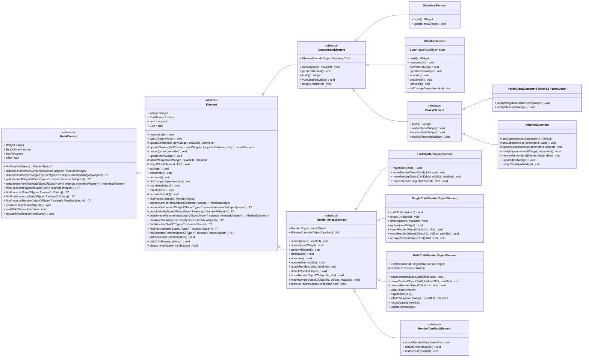

## Tree

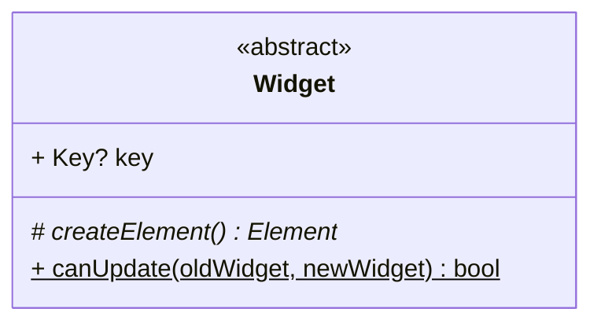

### Element Tree

```dart
abstract class Element {
  Element? _parent;
}
```

### Widget Tree

```dart
abstract class Element {
  Element(Widget widget) : _widget = widget;

  @override
  Widget get widget => _widget!;
  Widget? _widget;

  @mustCallSuper
  void update(covariant Widget newWidget) {
    _widget = newWidget;
  }

  @mustCallSuper
  void unmount() {
    _widget = null;
  }
}
```

### InheritedElement Tree

```dart
abstract class Element {
  PersistentHashMap<Type, InheritedElement>? _inheritedElements;

  @mustCallSuper
  void mount(Element? parent, Object? newSlot) {
    _updateInheritance();
  }

  @mustCallSuper
  void activate() {
    _updateInheritance();
  }

  @mustCallSuper
  void deactivate() {
    _inheritedElements = null;
  }

  void _updateInheritance() {
    _inheritedElements = _parent?._inheritedElements;
  }
}
```

```dart
class InheritedElement {
  @override
  void _updateInheritance() {
    final incomingWidgets =
        _parent?._inheritedElements ?? const PersistentHashMap<Type, InheritedElement>.empty();
    _inheritedElements = incomingWidgets.put(widget.runtimeType, this);
  }
}
```

### Element

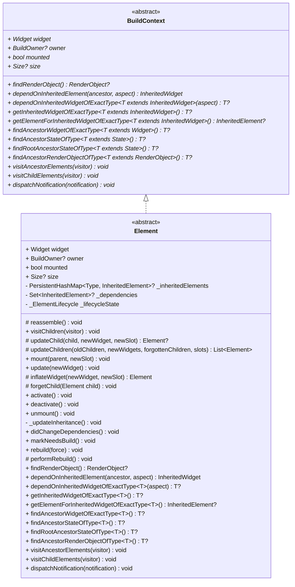


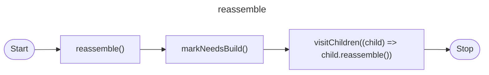

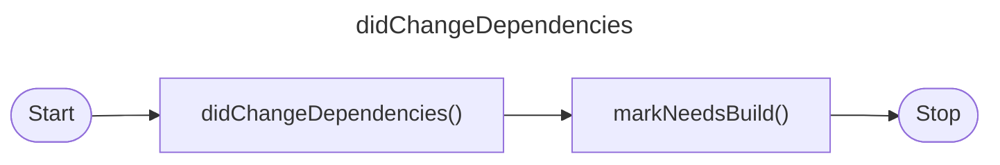


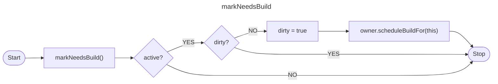


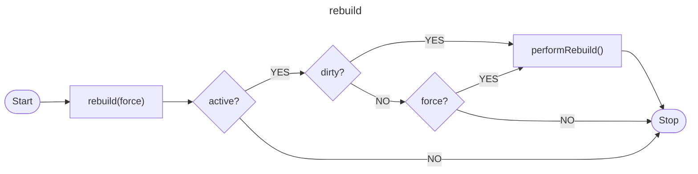

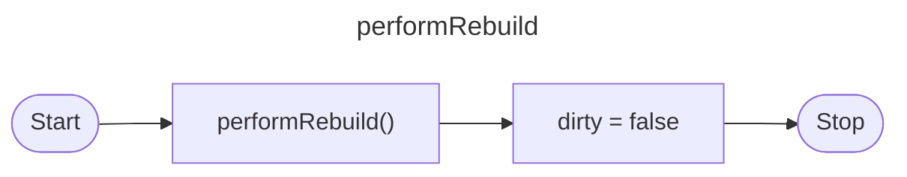

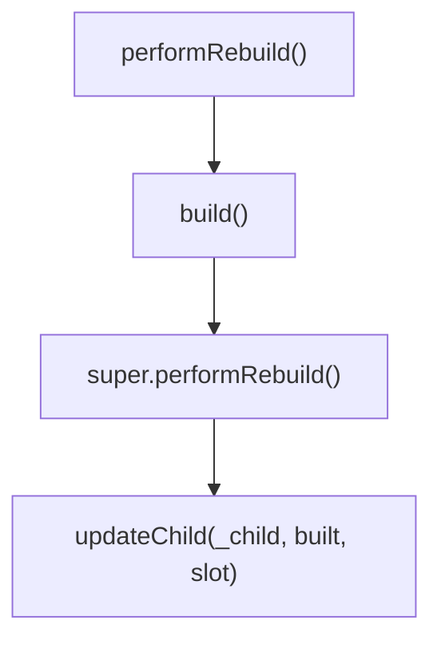

## StatelessWidget

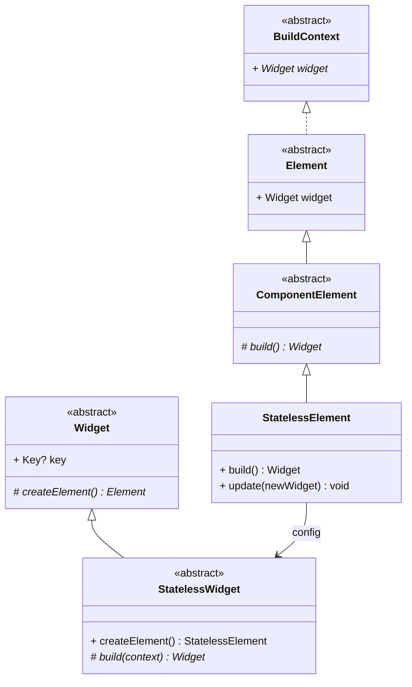

## StatefulWidget

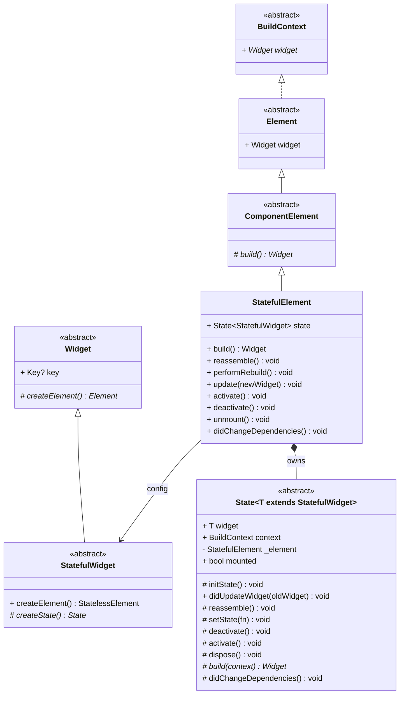

## ParentDataWidget


## InheritedWidget

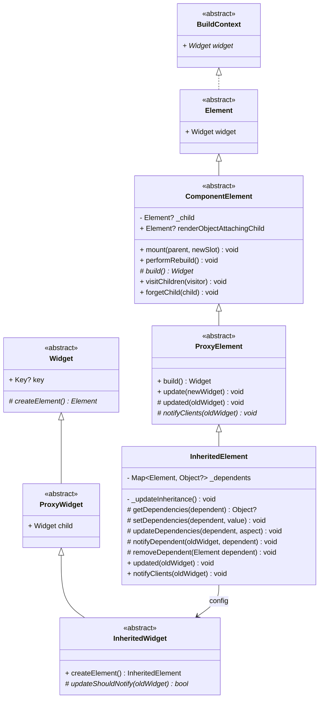


### Element Lifecycle

```dart
enum _ElementLifecycle {
  initial,
  active,
  inactive,
  defunct,
}
```

```dart
abstract class Element {
  _ElementLifecycle _lifecycleState = _ElementLifecycle.initial;
  
  @mustCallSuper
  void mount(Element? parent, Object? newSlot) {
    _lifecycleState = _ElementLifecycle.active;
  }

  @mustCallSuper
  void activate() {
    _lifecycleState = _ElementLifecycle.active;
  }

  @mustCallSuper
  void deactivate() {
    _lifecycleState = _ElementLifecycle.inactive;
  }
  
  @mustCallSuper
  void unmount() {
    _lifecycleState = _ElementLifecycle.defunct;
  }
}
```

## InheritedElement Dependencies

```dart
abstract class Element {
  Set<InheritedElement>? _dependencies;
  bool _hadUnsatisfiedDependencies = false;

  @mustCallSuper
  void activate() {
    _dependencies?.clear();
    _hadUnsatisfiedDependencies = false;  
  }

  @mustCallSuper
  void deactivate() {
    if (_dependencies != null && _dependencies!.isNotEmpty) {
      for (final InheritedElement dependency in _dependencies!) {
        dependency.removeDependent(this);
      }
    }
  }

  @mustCallSuper
  void unmount() {
    _dependencies = null;
  }

  @override
  InheritedWidget dependOnInheritedElement(InheritedElement ancestor, { Object? aspect }) {
    _dependencies ??= HashSet<InheritedElement>();
    _dependencies!.add(ancestor);
    ancestor.updateDependencies(this, aspect);
    return ancestor.widget as InheritedWidget;
  }

  @override
  T? dependOnInheritedWidgetOfExactType<T extends InheritedWidget>({Object? aspect}) {
    final InheritedElement? ancestor = _inheritedElements == null ? null : _inheritedElements![T];
    if (ancestor != null) {
      return dependOnInheritedElement(ancestor, aspect: aspect) as T;
    }
    _hadUnsatisfiedDependencies = true;
    return null;
  }
}
```

```dart
class InheritedElement extends ProxyElement {
  final Map<Element, Object?> _dependents = HashMap<Element, Object?>();

  @protected
  void setDependencies(Element dependent, Object? value) {
    _dependents[dependent] = value;
  }

  @protected
  void updateDependencies(Element dependent, Object? aspect) {
    setDependencies(dependent, null);
  }

  @protected
  @mustCallSuper
  void removeDependent(Element dependent) {
    _dependents.remove(dependent);
  }
}
```


## LeafRenderObjectWidget

## SingleChildRenderObjectWidget

## MultiChildRenderObjectWidget

## InheritedModel
