# Scroll

- `Scrollable`
- ScrollView
  - `CustomScrollView`
  - BoxScrollView
    - `ListView`
    - `GridView`
- `SingleChildScrollView`
- `PageView`
- `ReorderableListView`
- `ListWheelScrollView`
- `NestedScrollView`
- `DraggableScrollableSheet`
- `InteractiveViewer`

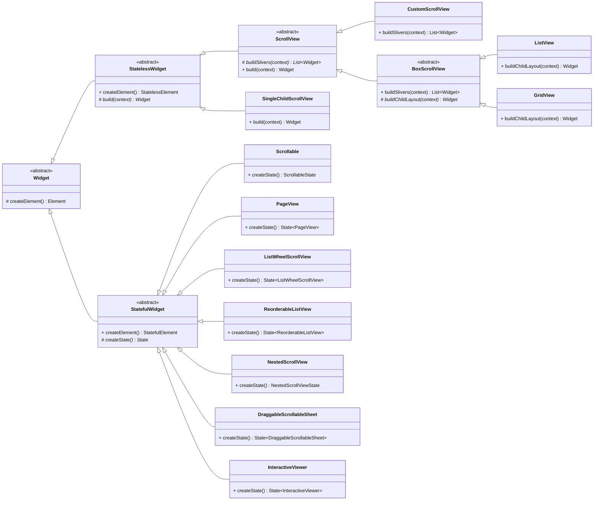

## Scrollable

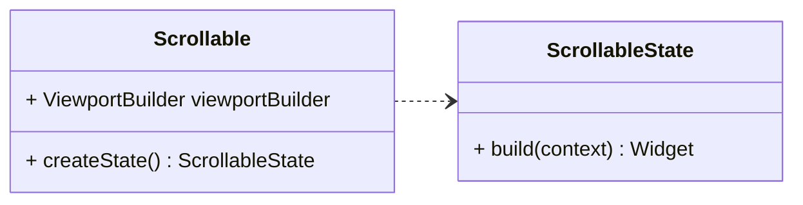

### ScrollView

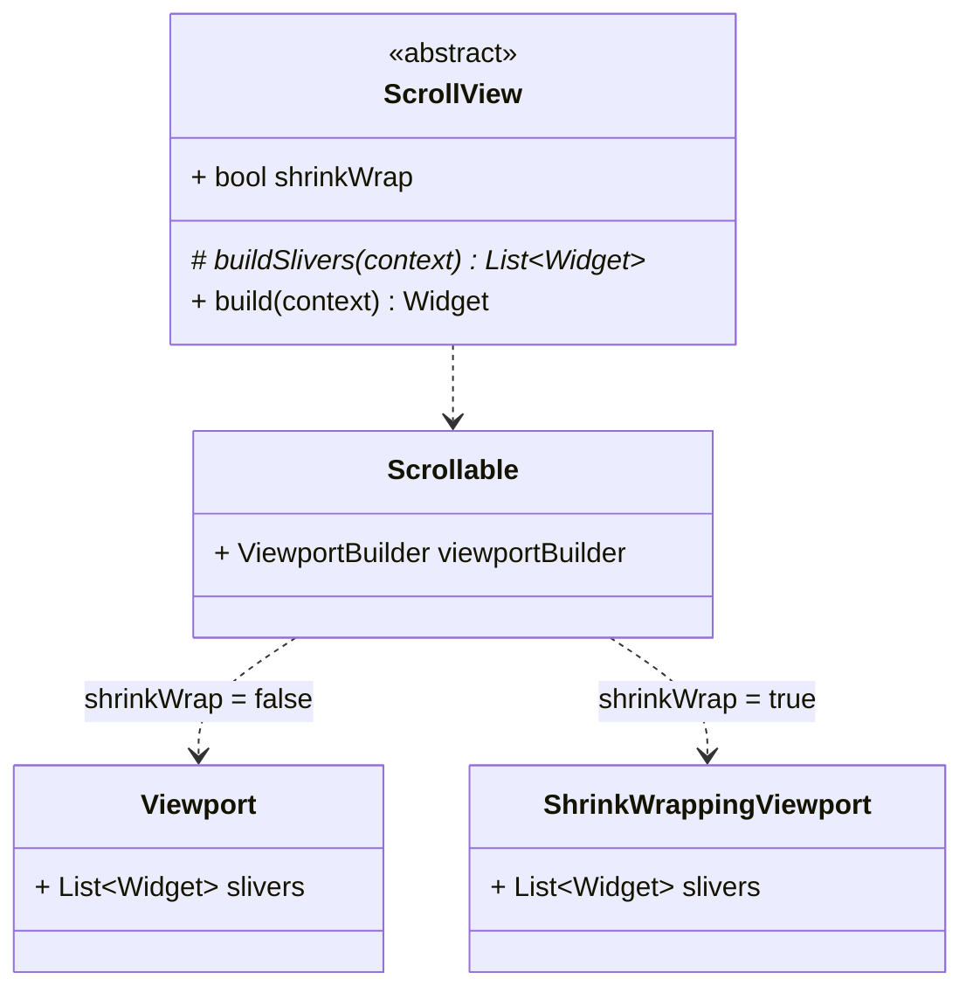

示意代码:

```dart
abstract class ScrollView extends StatelessWidget {
  List<Widget> buildSlivers(BuildContext context);

  Widget build(BuildContext context) {
    final List<Widget> slivers = buildSlivers(context);
    final Scrollable scrollable = Scrollable(
      viewportBuilder: (context, offset) {
        return Viewport(slivers: slivers);
      }
    );
    return scrollable;
  }
}
```

### CustomScrollView

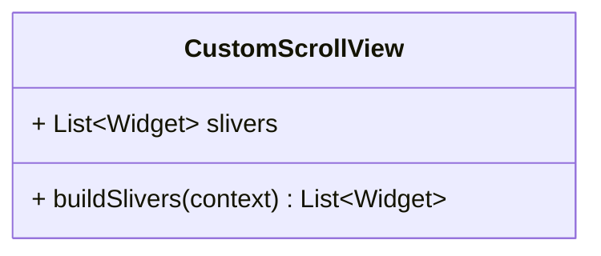

示意代码:

```dart
class CustomScrollView extends ScrollView {
  final List<Widget> slivers;

  List<Widget> buildSlivers(BuildContext context) => slivers;
}
```

> `Widget`s in these `slivers` must produce `RenderSliver` objects.

### BoxScrollView

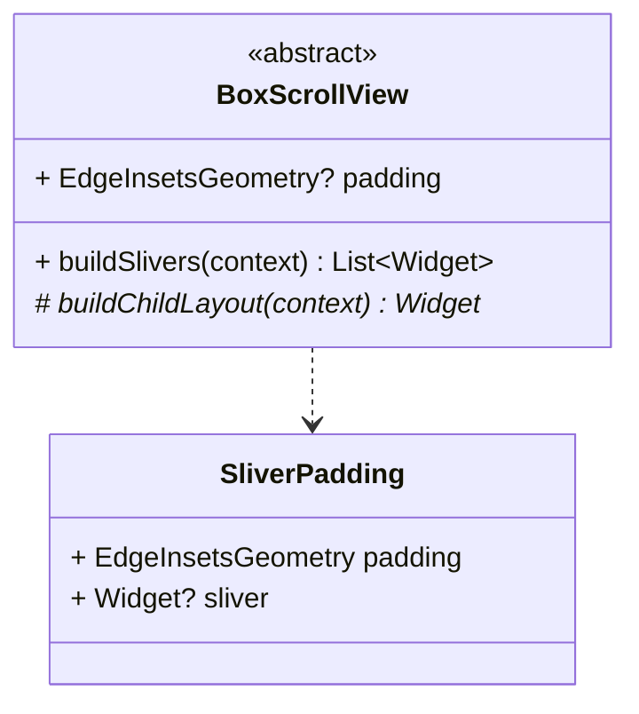

示意代码:

```dart
abstract class BoxScrollView extends ScrollView {
  final EdgeInsetsGeometry? padding;

  List<Widget> buildSlivers(BuildContext context) {
    Widget sliver = buildChildLayout(context);
    sliver = SliverPadding(padding: padding, sliver: sliver);
    return <Widget>[sliver];
  }

  Widget buildChildLayout(BuildContext context);
}
```

### ListView

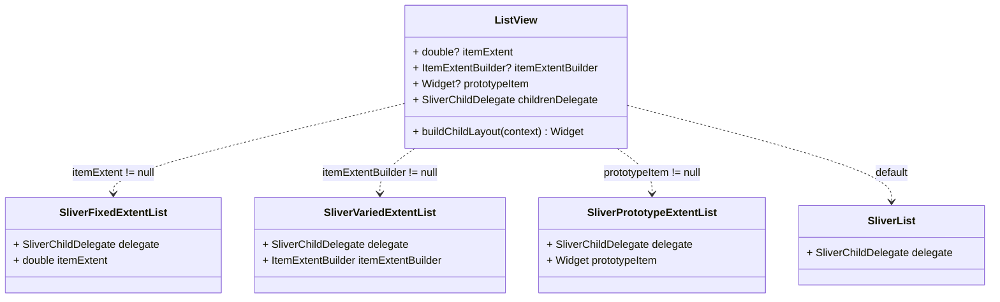

示意代码:

```dart
class ListView extends BoxScrollView {
  final SliverChildDelegate childrenDelegate;

  Widget buildChildLayout(BuildContext context) {
    return SliverList(delegate: childrenDelegate);
  }
}
```

| init               | childrenDelegate           |
| :----------------- | :------------------------- |
| ListView           | SliverChildListDelegate    |
| ListView.builder   | SliverChildBuilderDelegate |
| ListView.separated | SliverChildBuilderDelegate |
| ListView.custom    | o                          |

### GridView

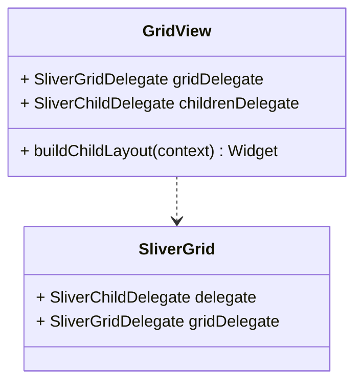

示意代码:

```dart
class GridView extends BoxScrollView {
  final SliverGridDelegate gridDelegate;
  final SliverChildDelegate childrenDelegate;

  Widget buildChildLayout(BuildContext context) {
    return SliverGrid(delegate: childrenDelegate, gridDelegate: gridDelegate);
  }
}
```

| init             | childrenDelegate           | gridDelegate                              |
| :--------------- | :------------------------- | :---------------------------------------- |
| GridView         | SliverChildListDelegate    | o                                         |
| GridView.builder | SliverChildBuilderDelegate | o                                         |
| GridView.custom  | o                          | o                                         |
| GridView.count   | SliverChildListDelegate    | SliverGridDelegateWithFixedCrossAxisCount |
| GridView.extent  | SliverChildListDelegate    | SliverGridDelegateWithMaxCrossAxisExtent  |

### SingleChildScrollView

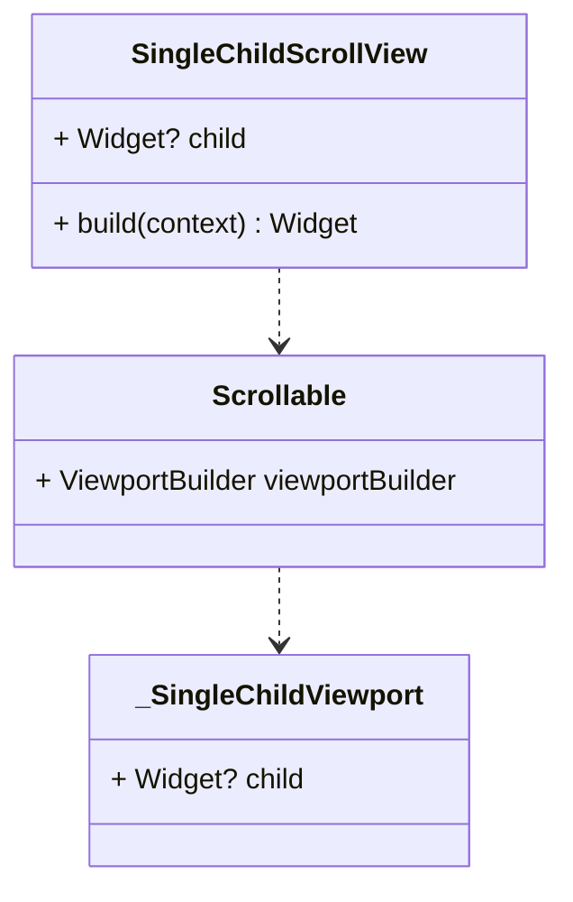

示意代码:

```dart
class SingleChildScrollView extends StatelessWidget {
  final Widget? child;

  Widget build(BuildContext context) {
    Widget scrollable = Scrollable(
      viewportBuilder: (context, offset) {
        return _SingleChildViewport(child: child);
      }
    );
    return scrollable;
  }
}
```

### PageView

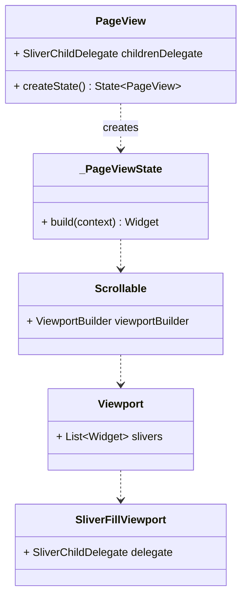

示意代码:

```dart
class PageView extends StatefulWidget {
  final SliverChildDelegate childrenDelegate;

  State<PageView> createState() => _PageViewState();
}

class _PageViewState extends State<PageView> {
  Widget build(BuildContext context) {
    return Scrollable(
      viewportBuilder: (context, offset) {
        return Viewport(slivers: <Widget>[
          SliverFillViewport(delegate: widget.childrenDelegate),
        ]);
      }
    );
  }
}
```

| init             | childrenDelegate           |
| :--------------- | :------------------------- |
| PageView         | SliverChildListDelegate    |
| PageView.builder | SliverChildBuilderDelegate |
| PageView.custom  | o                          |

### ReorderableListView

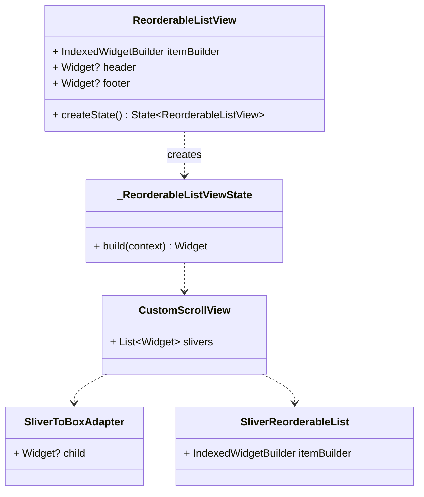

示意代码:

```dart
class ReorderableListView extends StatefulWidget {
  final IndexedWidgetBuilder itemBuilder;
  final Widget? header;
  final Widget? footer;

  State<ReorderableListView> createState() => _ReorderableListViewState();
}

class _ReorderableListViewState extends State<ReorderableListView> {
  Widget build(BuildContext context) {
    return CustomScrollView(
      slivers: <Widget>[
        SliverToBoxAdapter(child: widget.header),
        SliverReorderableList(itemBuilder: widget.itemBuilder),
        SliverToBoxAdapter(child: widget.footer),
      ],
    );
  }
}
```

### ListWheelScrollView

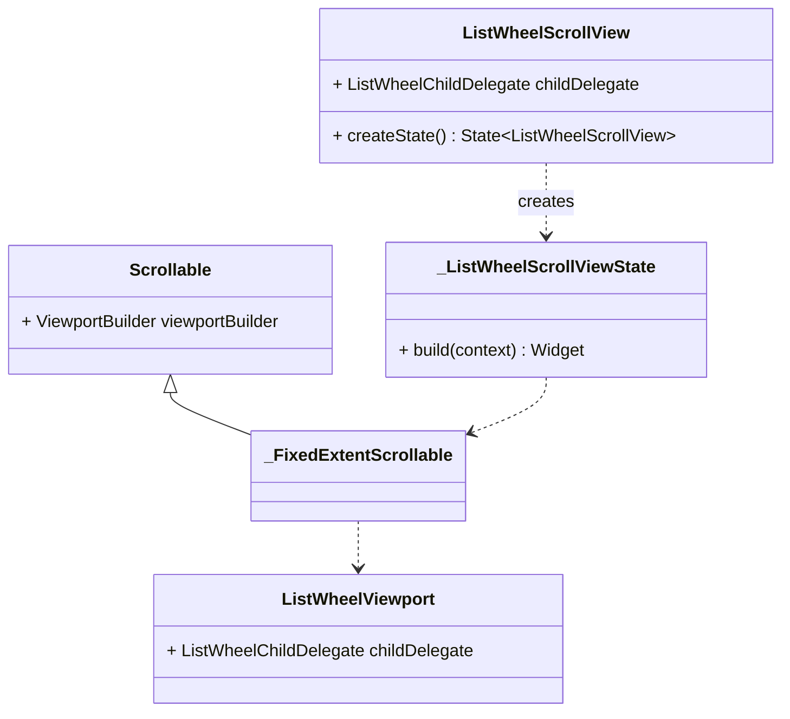

示意代码:

```dart
class ListWheelScrollView extends StatefulWidget {
  final ListWheelChildDelegate childDelegate;

  State<ListWheelScrollView> createState() => _ListWheelScrollViewState();
}

class _ListWheelScrollViewState extends State<ListWheelScrollView> {
  Widget build(BuildContext context) {
    return _FixedExtentScrollable(
      viewportBuilder: (context, offset) {
        return ListWheelViewport(childDelegate: widget.childDelegate);
      }
    );
  }
}
```

### NestedScrollView

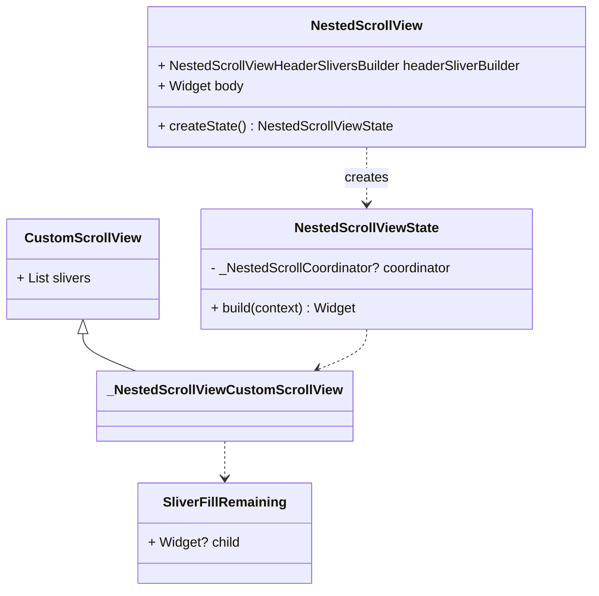

示意代码:

```dart
class NestedScrollView extends StatefulWidget {
  final NestedScrollViewHeaderSliversBuilder headerSliverBuilder;
  final Widget body;

  NestedScrollViewState createState() => NestedScrollViewState();
}

class NestedScrollViewState extends State<NestedScrollView> {
  _NestedScrollCoordinator? _coordinator;

  Widget build(BuildContext context) {
    return _NestedScrollViewCustomScrollView(
      slivers: <Widget>[
        ...widget.headerSliverBuilder(context, _coordinator.hasScrolledBody),
        SliverFillRemaining(child, widget.body),
      ],
    );
  }
}
```

## Others

### DraggableScrollableSheet

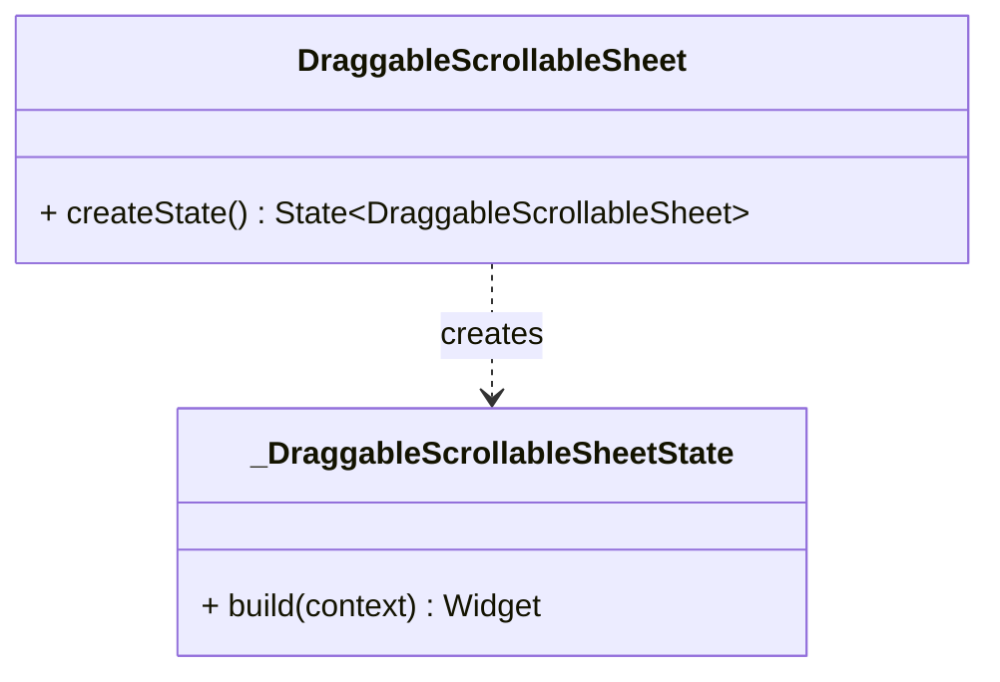

示意代码:

```dart
class DraggableScrollableSheet extends StatefulWidget {
  State<DraggableScrollableSheet> createState() => _DraggableScrollableSheetState();
}

class _DraggableScrollableSheetState extends State<DraggableScrollableSheet> {
  Widget build(BuildContext context) {
  }
}
```

### InteractiveViewer

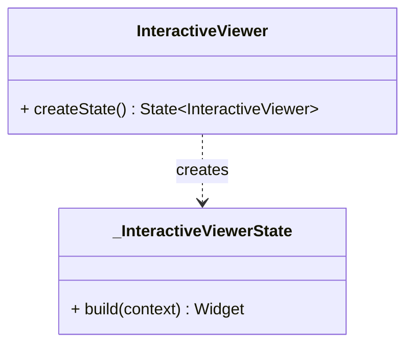

示意代码:

```dart
class InteractiveViewer extends StatefulWidget {
  State<InteractiveViewer> createState() => _InteractiveViewerState();
}

class _InteractiveViewerState extends State<InteractiveViewer> with TickerProviderStateMixin {
  Widget build(BuildContext context) {
  }
}
```
