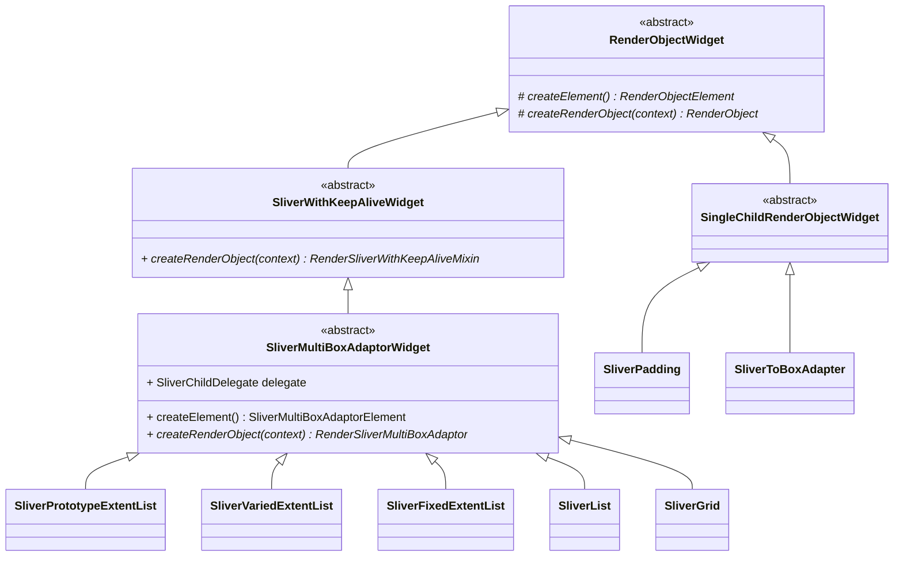

# Sliver

```mermaid
classDiagram
  class RenderObjectWidget {
    <<abstract>>
    # createElement() RenderObjectElement *
    # createRenderObject(context) RenderObject *
  }
  class SliverWithKeepAliveWidget {
    <<abstract>>
    + createRenderObject(context) RenderSliverWithKeepAliveMixin *
  }
  class SliverMultiBoxAdaptorWidget {
    <<abstract>>
    + SliverChildDelegate delegate
    + createElement() SliverMultiBoxAdaptorElement
    + createRenderObject(context) RenderSliverMultiBoxAdaptor *
  }
  class SliverPrototypeExtentList {
  }
  class SliverVariedExtentList {}
  class SliverFixedExtentList {}
  class SliverList {}
  class SliverGrid {}

  class SingleChildRenderObjectWidget {
    <<abstract>>
  }
  class SliverPadding {}
  class SliverToBoxAdapter {}

  RenderObjectWidget <|-- SliverWithKeepAliveWidget
  SliverWithKeepAliveWidget <|-- SliverMultiBoxAdaptorWidget
  SliverMultiBoxAdaptorWidget <|-- SliverPrototypeExtentList
  SliverMultiBoxAdaptorWidget <|-- SliverVariedExtentList
  SliverMultiBoxAdaptorWidget <|-- SliverFixedExtentList
  SliverMultiBoxAdaptorWidget <|-- SliverList
  SliverMultiBoxAdaptorWidget <|-- SliverGrid
  RenderObjectWidget <|-- SingleChildRenderObjectWidget
  SingleChildRenderObjectWidget <|-- SliverPadding
  SingleChildRenderObjectWidget <|-- SliverToBoxAdapter

```
