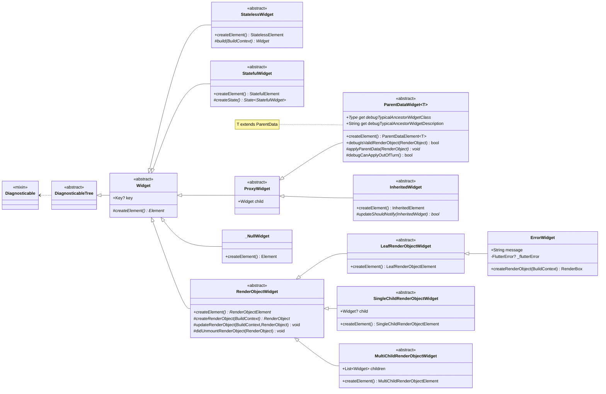
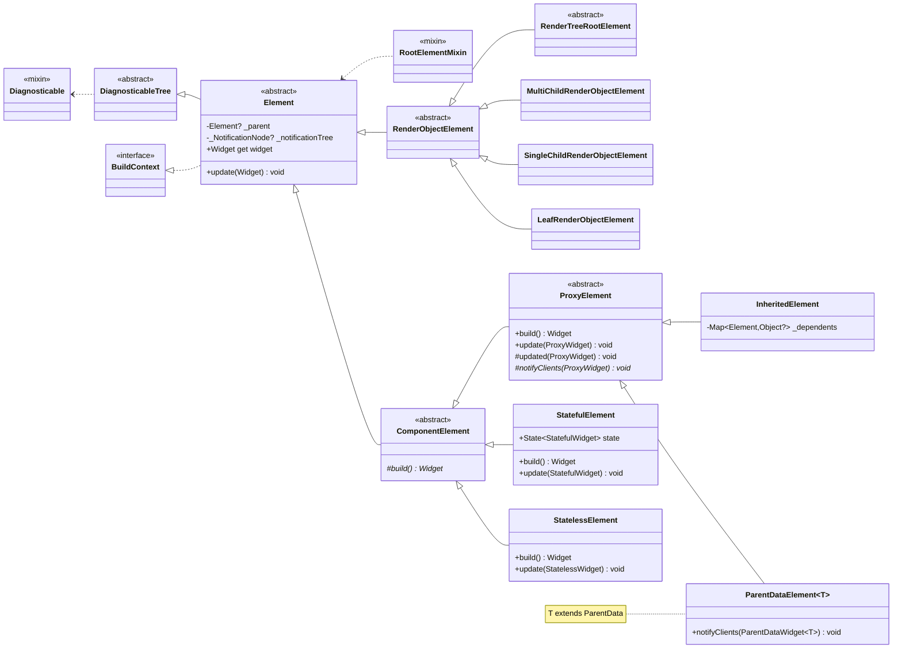
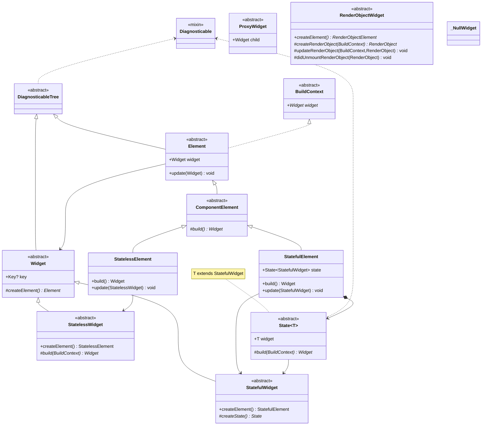

# Framework

## Widget

```mermaid
classDiagram
    direction LR

    class Diagnosticable {
        <<mixin>>
    }
    class DiagnosticableTree {
        <<abstract>>
    }
    class Widget {
        <<abstract>>
        +Key? key
        #createElement() Element*
    }
    class StatelessWidget {
        <<abstract>>
        +createElement() StatelessElement
        #build(BuildContext) Widget*
    }
    class StatefulWidget {
        <<abstract>>
        +createElement() StatefulElement
        #createState() State~StatefulWidget~*
    }
    class ProxyWidget {
        <<abstract>>
        +Widget child
    }
    class ParentDataWidget~T~ {
        <<abstract>>
        +createElement() ParentDataElement~T~
        +debugIsValidRenderObject(RenderObject) bool
        +Type get debugTypicalAncestorWidgetClass*
        +String get debugTypicalAncestorWidgetDescription
        #applyParentData(RenderObject) void*
        #debugCanApplyOutOfTurn() bool
    }
    note for ParentDataWidget "T extends ParentData"
    class InheritedWidget {
        <<abstract>>
        +createElement() InheritedElement
        #updateShouldNotify(InheritedWidget) bool*
    }
    class RenderObjectWidget {
        <<abstract>>
        +createElement() RenderObjectElement*
        #createRenderObject(BuildContext) RenderObject*
        #updateRenderObject(BuildContext,RenderObject) void
        #didUnmountRenderObject(RenderObject) void
    }
    class LeafRenderObjectWidget {
        <<abstract>>
        +createElement() LeafRenderObjectElement
    }
    class SingleChildRenderObjectWidget {
        <<abstract>>
        +Widget? child
        +createElement() SingleChildRenderObjectElement
    }
    class MultiChildRenderObjectWidget {
        <<abstract>>
        +List~Widget~ children
        +createElement() MultiChildRenderObjectElement
    }
    class ErrorWidget {
        +String message
        -FlutterError? _flutterError
        +createRenderObject(BuildContext) RenderBox
    }
    class _NullWidget {
        +createElement() Element
    }
    
    Diagnosticable <.. DiagnosticableTree
    DiagnosticableTree <|-- Widget
    Widget <|-- StatelessWidget
    Widget <|-- StatefulWidget
    Widget <|-- ProxyWidget
    Widget <|-- RenderObjectWidget
    Widget <|-- _NullWidget
    ProxyWidget <|-- ParentDataWidget
    ProxyWidget <|-- InheritedWidget
    RenderObjectWidget <|-- LeafRenderObjectWidget
    RenderObjectWidget <|-- SingleChildRenderObjectWidget
    RenderObjectWidget <|-- MultiChildRenderObjectWidget
    LeafRenderObjectWidget <|-- ErrorWidget
```

## Element

```mermaid
classDiagram
    direction LR

    class Diagnosticable {
        <<mixin>>
    }
    class DiagnosticableTree {
        <<abstract>>
    }
    class BuildContext {
        <<interface>>
    }
    class Element {
        <<abstract>>
        -Element? _parent
        -_NotificationNode? _notificationTree
        +Widget get widget
        +update(Widget) void
    }
    class ComponentElement {
        <<abstract>>
        #build() Widget*
    }
    class StatelessElement {
        +build() Widget
        +update(StatelessWidget) void
    }
    class StatefulElement {
        +State~StatefulWidget~ state
        +build() Widget
        +update(StatefulWidget) void
    }
    class ProxyElement {
        <<abstract>>
        +build() Widget
        +update(ProxyWidget) void
        #updated(ProxyWidget) void
        #notifyClients(ProxyWidget)void*
    }
    class ParentDataElement~T~ {
        +notifyClients(ParentDataWidget~T~) void
    }
    note for ParentDataElement "T extends ParentData"
    class InheritedElement {
        -Map~Element,Object?~ _dependents
    }
    class RenderObjectElement {
        <<abstract>>
    }
    class RootElementMixin {
        <<mixin>>
    }
    class LeafRenderObjectElement {
    }
    class SingleChildRenderObjectElement {
    }
    class MultiChildRenderObjectElement {
    }
    class RenderTreeRootElement {
        <<abstract>>
    }

    Diagnosticable <.. DiagnosticableTree
    DiagnosticableTree <|-- Element
    BuildContext <|.. Element
    Element <|-- ComponentElement
    Element <|-- RenderObjectElement
    Element <.. RootElementMixin
    ComponentElement <|-- StatelessElement
    ComponentElement <|-- StatefulElement
    ComponentElement <|-- ProxyElement
    ProxyElement <|-- ParentDataElement
    ProxyElement <|-- InheritedElement
    RenderObjectElement <|-- LeafRenderObjectElement
    RenderObjectElement <|-- SingleChildRenderObjectElement
    RenderObjectElement <|-- MultiChildRenderObjectElement
    RenderObjectElement <|-- RenderTreeRootElement
```

## tree

```mermaid
classDiagram
    class Diagnosticable {
        <<mixin>>
    }
    class DiagnosticableTree {
        <<abstract>>
    }

    class Widget {
        <<abstract>>
        +Key? key
        #createElement() Element*
    }
    class StatelessWidget {
        <<abstract>>
        +createElement() StatelessElement
        #build(BuildContext) Widget*
    }
    class StatefulWidget {
        <<abstract>>
        +createElement() StatefulElement
        #createState() State*
    }
    class ProxyWidget {
        <<abstract>>
        +Widget child
    }
    class RenderObjectWidget {
        <<abstract>>
        +createElement() RenderObjectElement*
        #createRenderObject(BuildContext) RenderObject*
        #updateRenderObject(BuildContext,RenderObject) void
        #didUnmountRenderObject(RenderObject) void
    }
    
    class _NullWidget {
    }

    class BuildContext {
        <<abstract>>
        +Widget widget*
    }
    class Element {
        <<abstract>>
        +Widget widget
        +update(Widget) void
    }
    class ComponentElement {
        <<abstract>>
        #build() Widget*
    }
    class StatelessElement {
        +build() Widget
        +update(StatelessWidget) void
    }
    class StatefulElement {
        +State~StatefulWidget~ state
        +build() Widget
        +update(StatefulWidget) void
    }
    
    class State ~T~ {
        <<abstract>>
        +T widget
        #build(BuildContext) Widget*
    }
    note for State "T extends StatefulWidget"

    Diagnosticable <.. DiagnosticableTree
    Diagnosticable <.. State
    DiagnosticableTree <|-- Widget
    DiagnosticableTree <|-- Element
    BuildContext <|.. Element
    Element <|-- ComponentElement
    ComponentElement <|-- StatelessElement
    ComponentElement <|-- StatefulElement
    Widget <|-- StatelessWidget
    Widget <|-- StatefulWidget

    Element --> Widget
    StatelessElement --> StatelessWidget
    StatefulElement *--> State
    StatefulElement --> StatefulWidget
    State --> StatefulWidget
```
