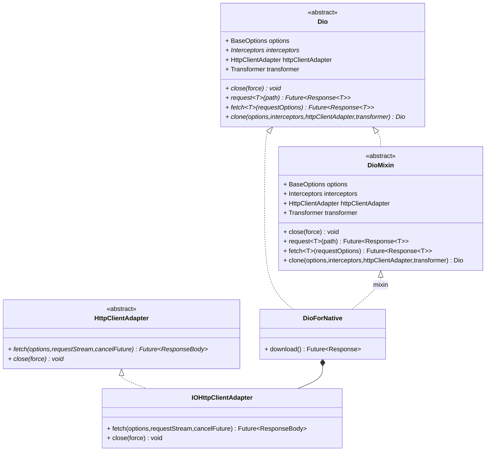

# Dio

## Usages

### Dio

```dart
final Dio dio = Dio();
```

### Interceptor

```dart
dio.interceptors.add(LogInterceptor());
```

### Request

```dart
final Response response = await dio.request('url');
```

## Blueprint



## Principle
