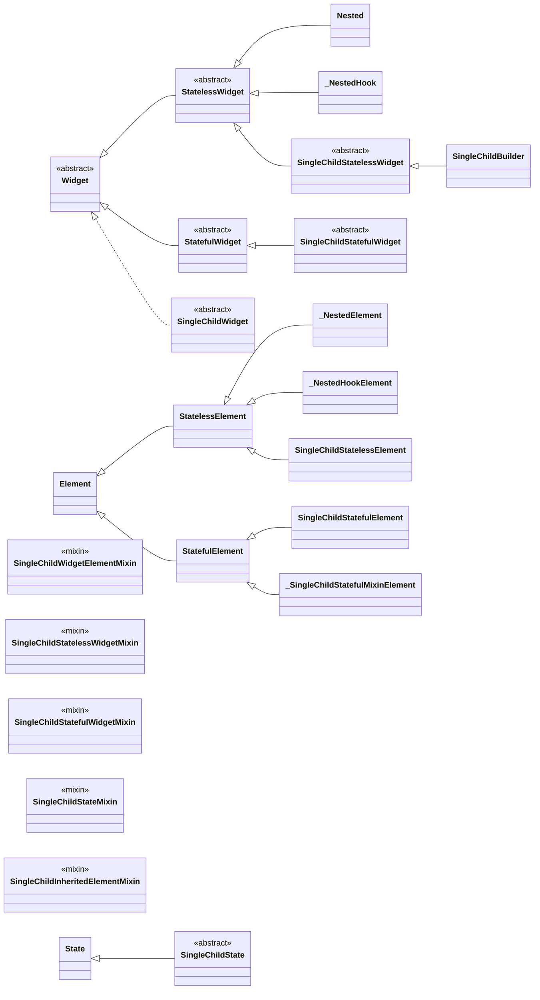

# Nested

[nested](https://pub.dev/packages/nested)
[repository](https://github.com/rrousselGit/nested)

```mermaid
classDiagram
  direction LR

  class Widget {
    <<abstract>>
  }
  class StatelessWidget {
    <<abstract>>
  }
  class StatefulWidget {
    <<abstract>>
  }
  class Element {}
  class StatelessElement {}
  class StatefulElement {}

  class Nested {}
  class _NestedElement {}
  class _NestedHook {}
  class _NestedHookElement {}
  class SingleChildWidget {
    <<abstract>>
  }
  class SingleChildWidgetElementMixin {
    <<mixin>>
  }
  class SingleChildStatelessWidget {
    <<abstract>>
  }
  class SingleChildStatelessElement {}
  class SingleChildStatefulWidget {
    <<abstract>>
  }
  class SingleChildState {
    <<abstract>>
  }
  class SingleChildStatefulElement {}
  class SingleChildBuilder {}
  class SingleChildStatelessWidgetMixin {
    <<mixin>>
  }
  class SingleChildStatefulWidgetMixin {
    <<mixin>>
  }
  class SingleChildStateMixin {
    <<mixin>>
  }
  class _SingleChildStatefulMixinElement {}
  class SingleChildInheritedElementMixin {
    <<mixin>>
  }

  Widget <|-- StatelessWidget
  Widget <|-- StatefulWidget
  Element <|-- StatelessElement
  Element <|-- StatefulElement
  StatelessWidget <|-- Nested
  StatelessElement <|-- _NestedElement
  StatelessWidget <|-- _NestedHook
  StatelessElement <|-- _NestedHookElement
  Widget <|.. SingleChildWidget
  StatelessWidget <|-- SingleChildStatelessWidget
  StatelessElement <|-- SingleChildStatelessElement
  StatefulWidget <|-- SingleChildStatefulWidget
  State <|-- SingleChildState
  StatefulElement <|-- SingleChildStatefulElement
  SingleChildStatelessWidget <|-- SingleChildBuilder
  StatefulElement <|-- _SingleChildStatefulMixinElement
```
