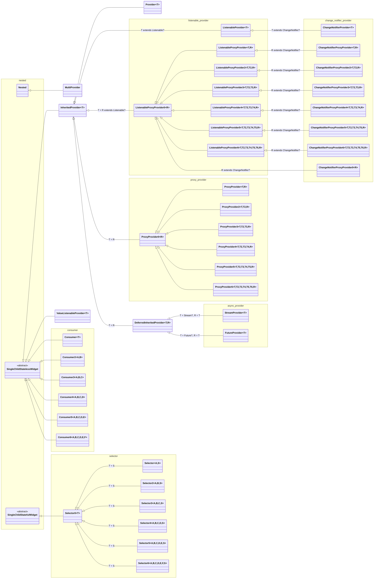
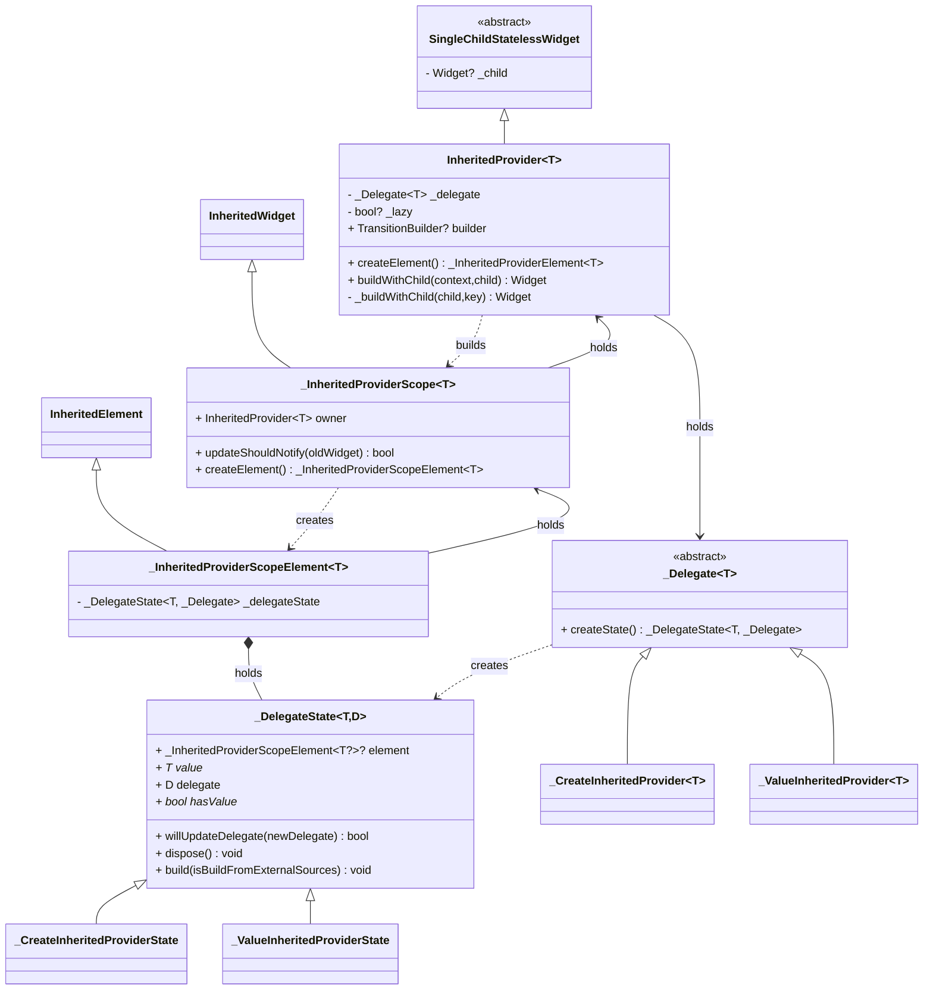
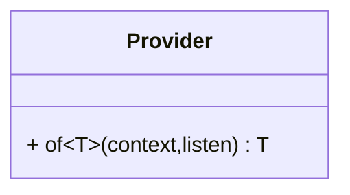
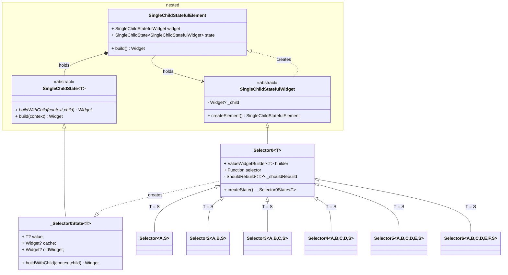

# Provider

[provider](https://pub.dev/packages/provider)
[repository](https://github.com/rrousselGit/provider)

dependencies:

- collection
- [nested](./nested.md)

## Usages

### Injection

```dart
Provider<Foo>(
  create: (context) => Foo(),
  child: CustomWidget(),
);
```

```dart
MultiProvider(
  providers: [
    Provider<Foo>(create: (_) => Foo()),
    Provider<Bar>(create: (_) => Bar()),
  ],
  child: CustomWidget(),
)
```

### Retrieve 

#### Widget

Consumer

```dart
Consumer<Foo>(
  builder: (BuildContext, Foo foo, Widget? child) {
    return FooWidget(foo: foo, child: child);
  },
  child: CustomWidget(),
)
```

Selector

```dart
Selector<Foo, Bar>(
  selector: (BuildContext context, Foo foo) => foo.bar,
  builder: (BuildContext context, Bar bar, Widget? child) {
    return BarWidget(bar: bar, child: child);
  },
  child: CustomWidget(),
)
```

#### Function

Provider.of

```dart
Widget build(BuildContext context) {
  Foo foo = Provider.of<Foo>(context);
  return Text(foo.name);
}
```

```dart
Widget build(BuildContext context) {
  return RaisedButton(
    onPressed: () {
      Foo foo = Provider.of<Foo>(context, listen: false);
      foo.bar();
    },
  );
}
```

BuildContext.read

```dart
Widget build(BuildContext context) {
  return RaisedButton(
    onPressed: () {
      context.read<Foo>().bar();
    },
  );
}
```

BuildContext.watch

```dart
Widget build(BuildContext context) {
  final Foo foo = context.watch<Foo>();
  return Text(foo.name);
}
```

BuildContext.select

```dart
Widget build(BuildContext context) {
  final String name = context.select<Foo, String>((Foo foo) => foo.name);
  return Text(name);
}
```

Locator

```dart
class Foo {
  Foo(this.read);
  final Locator read;
  void bar() {
    print(read<Bar>());
  }
}

Widget build(BuildContext context) {
  return Provider(
    create: (context) => Foo(context.read),
    child: CustomWidget(),
  );
}
```

## Blueprint



## Principle

### InheritedProvider



### MultiProvider

### Provider



### Consumer

```dart
class Consumer<T> extends SingleChildStatelessWidget {
  final Widget Function(BuildContext context, T value, Widget? child) builder;

  @override
  Widget buildWithChild(BuildContext context, Widget? child) {
    return builder(
      context,
      Provider.of<T>(context),
      child,
    );
  }
}
```

### Selector



```dart
typedef ShouldRebuild<T> = bool Function(T previous, T next);
```

```dart
class Selector0<T> {
  Selector0({
    Key? key,
    required this.builder,
    required this.selector,
    ShouldRebuild<T>? shouldRebuild,
    Widget? child,
  })  : _shouldRebuild = shouldRebuild,
        super(key: key, child: child);

  final ValueWidgetBuilder<T> builder;
  final T Function(BuildContext) selector;
  final ShouldRebuild<T>? _shouldRebuild;
}
```
