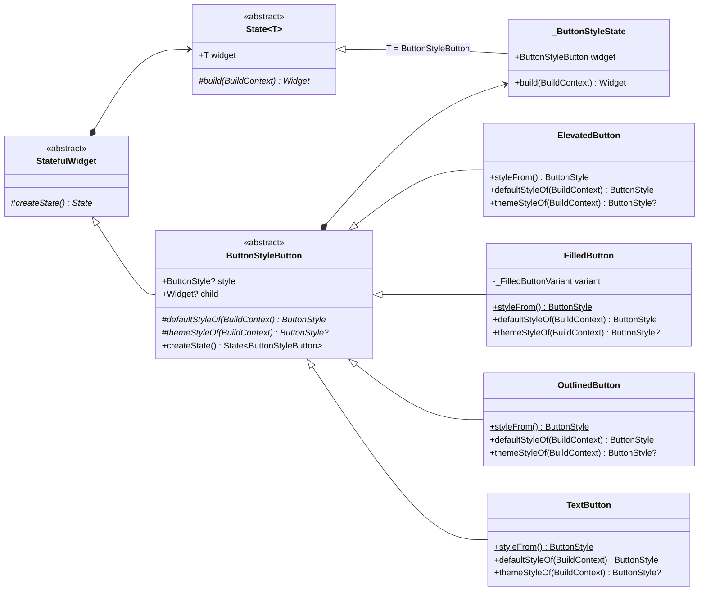

# Button

## ButtonStyleButton

按钮样式优先级: 
widget.style? > widget.themeStyleOf()? > widget.defaultStyleOf()

文本样式优先级: 
style.textStyle? > Theme.textTheme.bodyMedium!

文本颜色优先级: 
style.foregroundColor? > style.textStyle.color?

图标颜色优先级: 
style.iconColor? > style.foregroundColor? > IconThemeData.color?

边框样式优先级: 
style.side? > style.shape.side

阴影颜色优先级: 
style.shadowColor? > M3: Theme.colorScheme.shadow | M2: Theme.shadowColor

叠加颜色优先级: 
style.overlayColor? > Theme.splashColor

水波纹效果优先级: 
style.splashFactory? > Theme.splashFactory

## ElevatedButton

## FilledButton

## OutlinedButton

## TextButton
