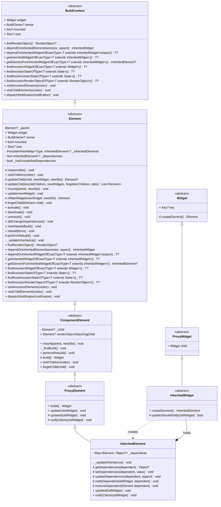
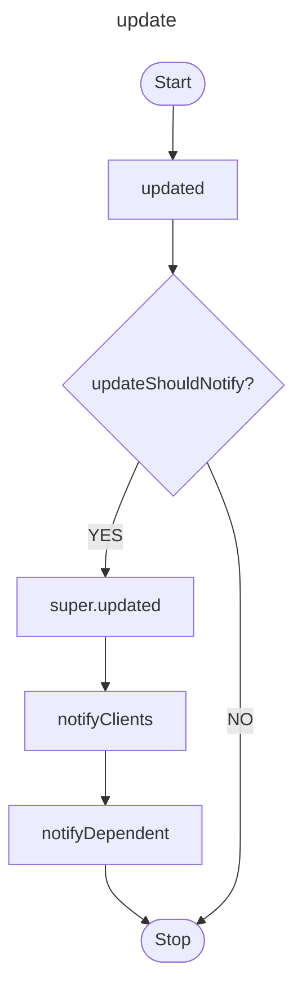
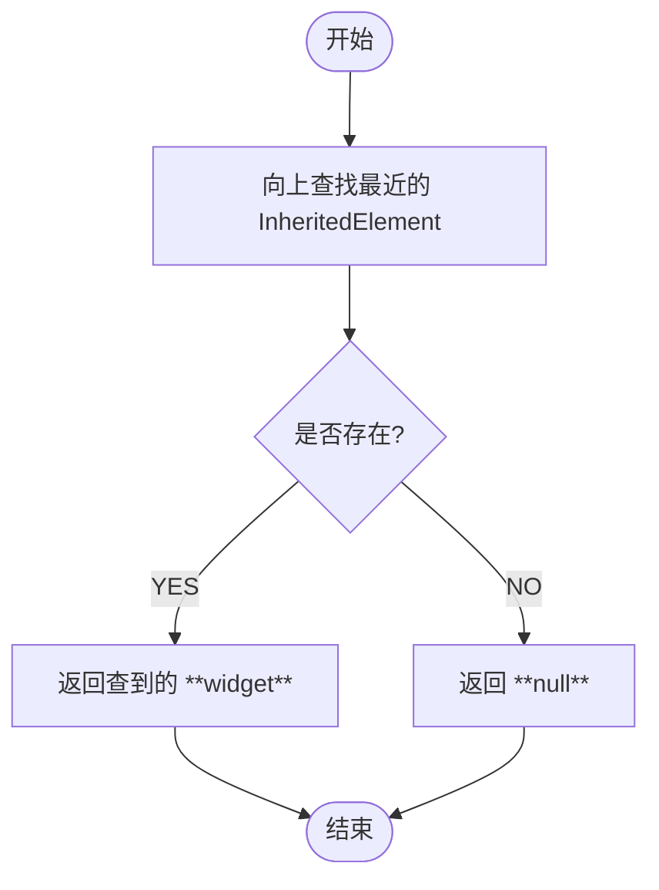
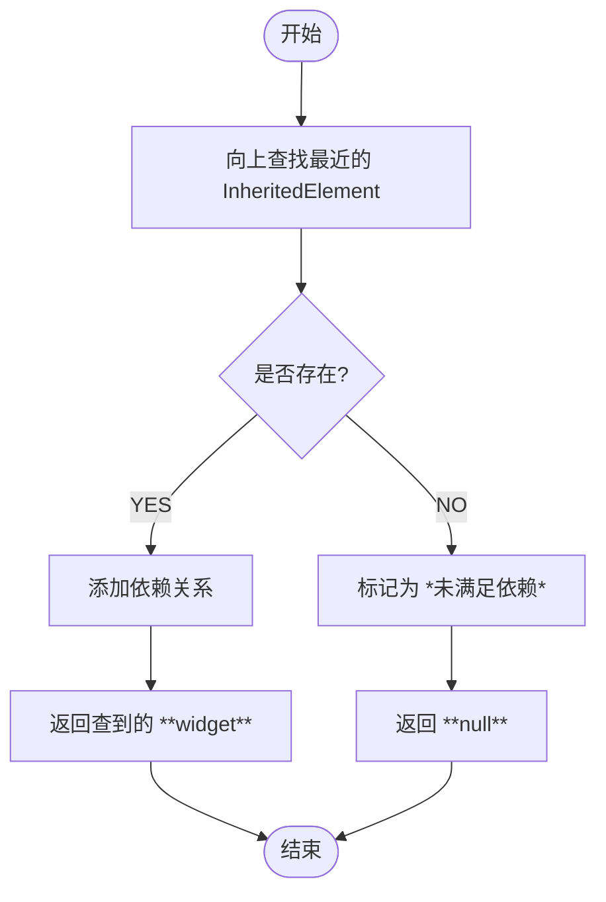

# InheritedWidget

## Usages

```dart
_ScrollableScope? widget = context.getInheritedWidgetOfExactType<_ScrollableScope>();
```

## Principle



### InheritedElement Tree

```dart
abstract class Element {
  PersistentHashMap<Type, InheritedElement>? _inheritedElements;

  @mustCallSuper
  void mount(Element? parent, Object? newSlot) {
    _updateInheritance();
  }

  @mustCallSuper
  void activate() {
    _updateInheritance();
  }

  @mustCallSuper
  void deactivate() {
    _inheritedElements = null;
  }

  void _updateInheritance() {
    _inheritedElements = _parent?._inheritedElements;
  }
}
```

```dart
class InheritedElement extends ProxyElement {
  @override
  void _updateInheritance() {
    final incomingWidgets =
        _parent?._inheritedElements ?? const PersistentHashMap<Type, InheritedElement>.empty();
    _inheritedElements = incomingWidgets.put(widget.runtimeType, this);
  }
}
```


### InheritedElement Dependencies

```dart
abstract class Element {
  Set<InheritedElement>? _dependencies;
  bool _hadUnsatisfiedDependencies = false;

  @mustCallSuper
  void activate() {
    _dependencies?.clear();
    _hadUnsatisfiedDependencies = false;    
  }

  @mustCallSuper
  void deactivate() {
    if (_dependencies != null && _dependencies!.isNotEmpty) {
      for (final InheritedElement dependency in _dependencies!) {
        dependency.removeDependent(this);
      }
    }
  }

  @mustCallSuper
  void unmount() {
    _dependencies = null;
  }

  @override
  InheritedWidget dependOnInheritedElement(InheritedElement ancestor, { Object? aspect }) {
    _dependencies ??= HashSet<InheritedElement>();
    _dependencies!.add(ancestor);
    ancestor.updateDependencies(this, aspect);
    return ancestor.widget as InheritedWidget;
  }

  @override
  T? dependOnInheritedWidgetOfExactType<T extends InheritedWidget>({Object? aspect}) {
    final InheritedElement? ancestor = _inheritedElements == null ? null : _inheritedElements![T];
    if (ancestor != null) {
      return dependOnInheritedElement(ancestor, aspect: aspect) as T;
    }
    _hadUnsatisfiedDependencies = true;
    return null;
  }
}
```

```dart
class InheritedElement extends ProxyElement {
  final Map<Element, Object?> _dependents = HashMap<Element, Object?>();

  @protected
  void setDependencies(Element dependent, Object? value) {
    _dependents[dependent] = value;
  }

  @protected
  void updateDependencies(Element dependent, Object? aspect) {
    setDependencies(dependent, null);
  }

  @protected
  @mustCallSuper
  void removeDependent(Element dependent) {
    _dependents.remove(dependent);
  }
}
```

### InheritedElement didChangeDependencies

```dart
abstract class Element {
  @mustCallSuper
  void activate() {
    final bool hadDependencies = (_dependencies != null && _dependencies!.isNotEmpty) || _hadUnsatisfiedDependencies;
    if (hadDependencies) {
      didChangeDependencies();
    }
  }

  @mustCallSuper
  void didChangeDependencies() {
    markNeedsBuild();
  }
}
```

```dart
abstract class ProxyElement extends ComponentElement {
  @override
  void update(ProxyWidget newWidget) {
    final ProxyWidget oldWidget = widget as ProxyWidget;
    updated(oldWidget);
  }

  @protected
  void updated(covariant ProxyWidget oldWidget) {
    notifyClients(oldWidget);
  }

  @protected
  void notifyClients(covariant ProxyWidget oldWidget);
}
```

```dart
class InheritedElement extends ProxyElement {
  @protected
  void notifyDependent(covariant InheritedWidget oldWidget, Element dependent) {
    dependent.didChangeDependencies();
  }

  @override
  void updated(InheritedWidget oldWidget) {
    if ((widget as InheritedWidget).updateShouldNotify(oldWidget)) {
      super.updated(oldWidget);
    }
  }

  @override
  void notifyClients(InheritedWidget oldWidget) {
    for (final Element dependent in _dependents.keys) {     
      notifyDependent(oldWidget, dependent);
    }
  }
}
```




**getInheritedWidgetOfExactType**

返回最近的widget, 无依赖关系



**dependOnInheritedWidgetOfExactType**

返回最近的widget,并建立依赖关系


