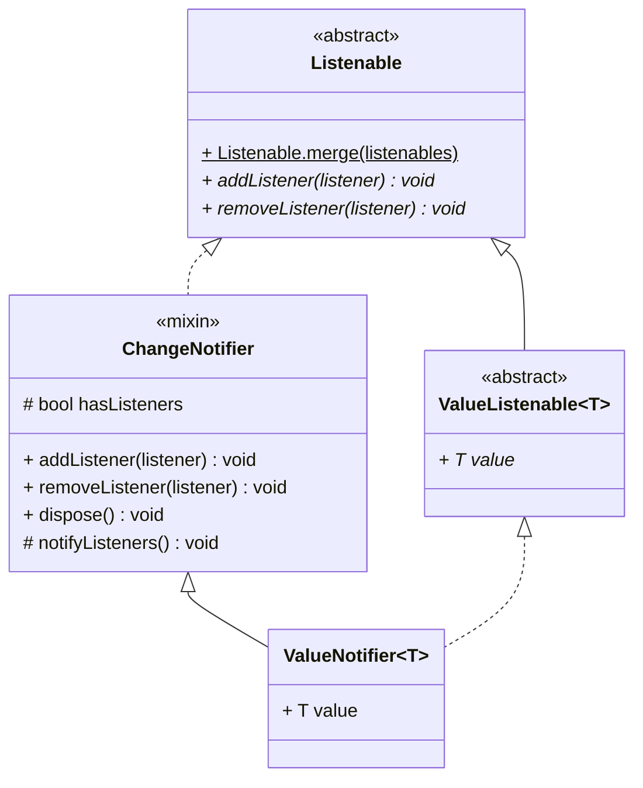
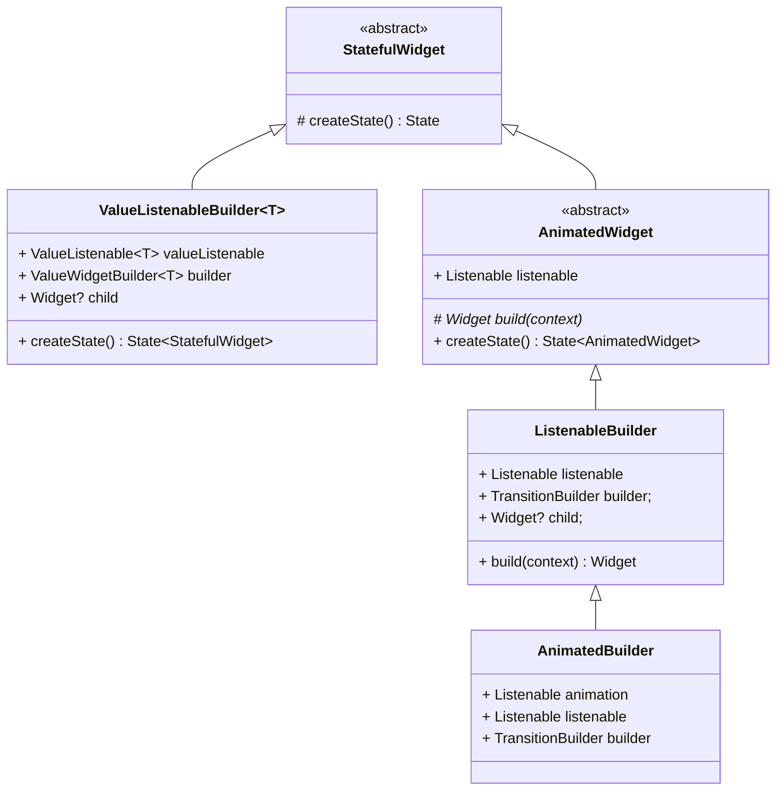

# Listenable



## Usages



## Principle

### changeNotifier

```dart
mixin class changeNotifier {
  int _count = 0;
  List<VoidCallback?> _listeners = _emptyListeners;

  @protected
  void notifyListeners() {
    if (_count == 0) {
      return;
    }
    final int end = _count;
    for (int i = 0; i < end; i++) {
      _listeners[i]?.call();
    }
  }
}
```

### ValueNotifier

```dart
class ValueNotifier<T> {
  T _value;

  @override
  T get value => _value;

  set value(T newValue) {
    if (_value == newValue) return;
    _value = newValue;
    notifyListeners();
  }
}
```
